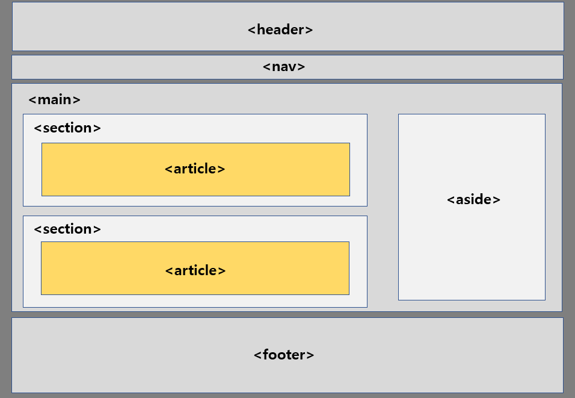

## 레이아웃(=공간배치)


```angular2html
<div> ~ </div> : 콘텐츠 묶기

<header> ~ </header> : 상단 영역(로고, 타이틀, ...)

<nav> ~ </nav> : 메뉴

<section> ~ </section> : 콘텐츠 영역

<article> ~ </article> : 콘텐츠 내용

<aside> ~ </aside> : 콘텐츠 이외의 내용(배너, 문구, ...)

<footer> ~ </footer> : 하단영역(제작정보, 저작권, ...)
```
