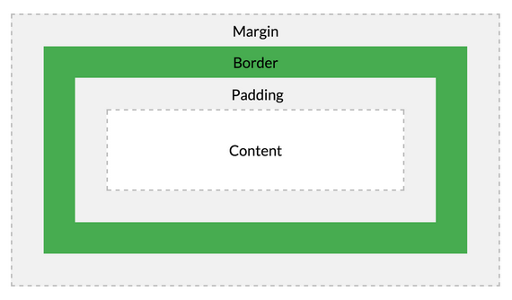

## 박스( ≒ 블록 요소 )



>``margin`` : 박스 ~ 박스 / 박스 ~ 테두리<br>
>``border`` : 테두리<br>
>``padding`` : 테두리 ~ 콘텐츠 영역<br>
>``content`` : 콘텐츠 영역

+ ### 생성
    ```
    <레이아웃_태그> 요소 </레이아웃_태그>
    ```

+ ### 크기
    ```angular2html
    width/height: 크기 / auto
    가로   세로          
    ```

+ ### 테두리
    ```angular2html
    border-[top/right/bottom/left-] 속성 : 속성값
    ```
  + 속성 : 속성값

     + 종류
       ```
       border-style: solid / dotted / dashed / double
                      실선    점선     짧은선   이중선
       ```
     + 두께
       ```angular2html
       border-width: 크기 / thick
                           두껍게
       ```
     + 색깔
       ```angular2html
       border-color: 색깔
       ```
     + 모서리(둥글게)
       ```angular2html
       border-radius: 크기
       ```
     + 축약 ★★
       ```
       border: 두께 종류 색깔
       ```
     + 그림자
       ```angular2html
       box-shadow: 크기    크기    크기    크기   색깔
                   가로    세로  흐림정도 번짐정도
       ```

+ ### 여백
    ```angular2html
    margin/padding [-top/right/bottom/left] : 크기 / auto
    ```
+ ### 여백 축약
    ```angular2html
    margin/padding: 위 오른 아래 왼       # 4
                    위  오른,왼  아래     # 3
                    위,아래  오른,왼      # 2
    ```
